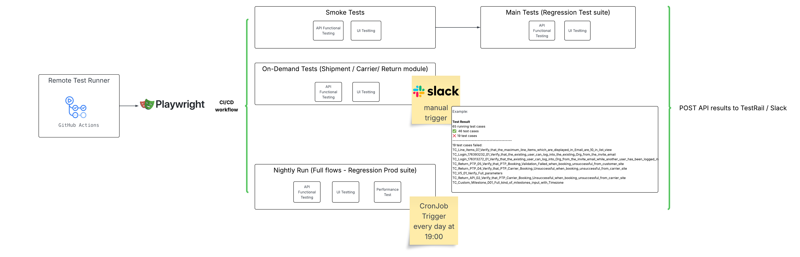

# Playwright Automation Framework

This is a comprehensive automation framework for testing both UI and APIs using Playwright.

## Architecture



The architecture diagram shows the complete test automation flow:
1. Multiple trigger points (GitHub Actions, Cron Jobs, Slack Commands)
2. Three layers of testing:
   - App Unit Testing for low-level modules
   - API Functional Testing using Playwright
   - UI/UX App Testing with device simulation and network conditions
3. Integration with TestRail for test case management
4. Real-time notifications via Slack

## Prerequisites

- Node.js (v16 or higher)
- npm (v7 or higher)

## Setup

1. Clone the repository
2. Install dependencies:
   ```bash
   npm install
   ```
3. Copy `.env.example` to `.env` and update the values:
   ```bash
   cp .env.example .env
   ```
4. Install Playwright browsers:
   ```bash
   npx playwright install
   ```

## Test Suites Architecture

The framework consists of three main test suites:

### 1. On-Demand Tests
- Focus on specific website modules:
  - Shipment Overview
  - Return Overview
  - Carrier Overview
- Can be triggered manually via:
  - GitHub Actions workflow
  - Slack commands
- Each module has both UI and API tests

### 2. Regression Tests
- Comprehensive test suite covering all functionality
- Can be triggered manually via GitHub Actions workflow
- Runs automatically on production branch pushes
- Scheduled nightly runs (1 AM UTC)
- Includes both UI and API tests

### 3. Smoke Tests
- Quick validation of critical functionality
- Runs as part of the main test workflow
- Acts as a gatekeeper before running full regression tests

## Automation Triggers

### GitHub Actions
- Manual trigger via workflow dispatch
- Automatic trigger on production branch pushes
- Nightly scheduled runs
- Environment selection (Bruno/Apollo)

### Slack Integration
- On-demand test execution via Slack commands
- Real-time test results notification
- Support for all test suites and modules
- Channel-specific notifications

## Running Tests

### Basic Commands
- Run smoke tests: `npm run smoke_test`
- Run regression tests: `npm run regression_test`
- Run regression tests for production: `npm run regression_prod`
- Run module-specific tests:
  - Carrier Overview: `npm run on_demand:carrier_overview`
  - Return Overview: `npm run on_demand:return_overview`
  - Shipment Overview: `npm run on_demand:shipment_overview`

### Local Development (Headed Mode with Debug)
- Run smoke tests locally: `npm run local:smoke_test`
- Run regression tests locally: `npm run local:regression_test`
- Run regression tests for production locally: `npm run local:regression_prod`
- Run module-specific tests locally:
  - Carrier Overview: `npm run local:carrier_overview`
  - Return Overview: `npm run local:return_overview`
  - Shipment Overview: `npm run local:shipment_overview`

### UI Mode (Interactive Test Runner)
- Run smoke tests in UI mode: `npm run ui:smoke`
- Run regression tests in UI mode: `npm run ui:regression`
- Run module-specific tests in UI mode:
  - Carrier Overview: `npm run ui:carrier`
  - Return Overview: `npm run ui:return`
  - Shipment Overview: `npm run ui:shipment`

### Reports
View test report:
```bash
npm run report
```

## Project Structure

```
├── suites/                  # Test suites
│   ├── 01. On-Demand/      # On-demand test suite
│   │   ├── carrier/        # Carrier module tests
│   │   ├── return/         # Return module tests
│   │   └── shipment/       # Shipment module tests
│   ├── 02. Regression/     # Regression test suite
│   └── 03. Smoke/          # Smoke test suite
├── core/                    # Core framework components
│   ├── api/                # API testing utilities
│   ├── base/               # Base test configurations
│   ├── components/         # Reusable UI components
│   ├── constants/          # Framework constants
│   ├── enums/              # Type definitions
│   ├── helper/             # Helper functions
│   └── pages/              # Page object models

├── tcs/                    # Test case specifications
├── .github/                # GitHub Actions workflows
├── playwright.config.js    # Playwright configuration
```

## Best Practices

1. Use page objects for UI elements
2. Keep tests independent and atomic
3. Use environment variables for configuration
4. Follow the AAA pattern (Arrange, Act, Assert)
5. Use meaningful test descriptions
6. Implement proper error handling
7. Use data-driven testing where appropriate
8. Tag tests appropriately for module organization
9. Keep module-specific tests focused on their domain
10. Maintain clear separation between modules 